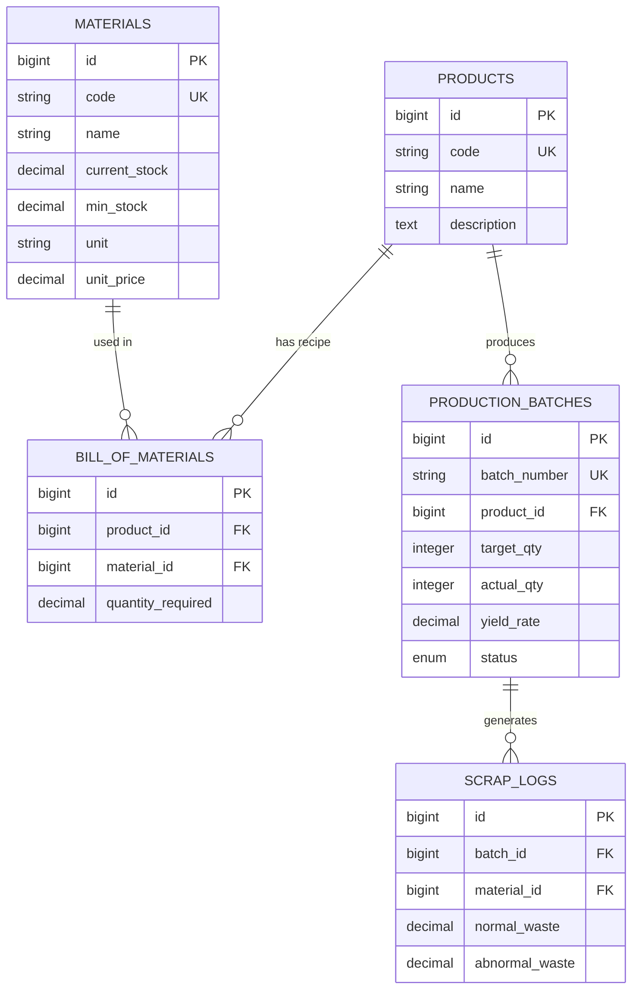

# 📦 RawMat Control - Industrial Raw Material & Scrap Management System

[](https://laravel.com)
[](https://getbootstrap.com)
[](https://www.mysql.com)
[](https://www.php.net)

**RawMat Control** adalah aplikasi web manajemen bahan baku (*raw material*) dan pelacakan limbah produksi (*scrap/waste*) yang dirancang khusus untuk industri manufaktur **Plastik & Kemasan (Plastics & Packaging)**. Sistem ini mengintegrasikan resep *Bill of Materials* (BOM), kalkulasi penggunaan bahan otomatis, pengawasan stok kritis (*min stock*), hingga evaluasi efisiensi produksi (*Yield Rate*).

---

## 🌟 Fitur Utama

- 🏭 **Manajemen Bill of Materials (BOM)**
  - Pengelolaan resep pembuatan produk master (kombinasi *Polypropylene*, *HDPE*, *Masterbatch*, aditif, dan kemasan).
  - *Auto-fill* kebutuhan bahan baku secara otomatis saat memilih produk pada pencatatan batch baru.

- 🔄 **Pelacakan Batch Produksi & Pemotongan Stok Otomatis**
  - Manajemen status alur batch (*Draft*, *In Progress*, *Completed*).
  - Eksekusi pemotongan stok bahan baku di tabel `materials` secara *real-time* saat batch diselesaikan.

- ♻️ **Pencatatan Limbah & Kalkulasi Yield Rate**
  - Pemisahan pencatatan limbah normal (*normal waste*) dan limbah tidak normal (*abnormal waste*).
  - Perhitungan persentase efisiensi keberhasilan produksi:
    $$\text{Yield Rate} = \left( \frac{\text{Actual Output}}{\text{Target Quantity}} \right) \times 100\%$$
  - Logging otomatis riwayat limbah ke tabel `scrap_logs`.

- 📊 **Dashboard Analitik Real-Time**
  - **KPI Cards**: Indikator Stok Kritis (*Warning Restock*), Rata-rata Yield Rate, Total Akumulasi Scrap, dan Jumlah Batch Aktif.
  - **Interactive Chart**: Visualisasi tren Yield Rate selama 6 bulan terakhir.

- 🌙 **Persistent Full-Black Dark Mode**
  - Mode gelap hitam pekat elegan menggunakan Bootstrap 5 `data-bs-theme`, CSS Variables, dan `localStorage`.
  - Dilengkapi skrip *anti-FOUC* (Flash of Unstyled Content) untuk mencegah kedipan layar saat memuat halaman.

---

## 🛠️ Teknologi & Stack

- **Backend**: PHP 8.x, Laravel Framework
- **Frontend**: Blade Templating, Bootstrap 5.3, Bootstrap Icons, Chart.js
- **Database**: MySQL Relational Database
- **Styling Custom**: CSS Variables (Dynamic Light/Dark Themes), Plus Jakarta Sans Font

---

## 🗄️ Skema Database (Relational Schema)

Sistem ini dikembangkan menggunakan struktur database relasional terintegrasi:



---

## 🚀 Panduan Instalasi (Getting Started)

### Prasyarat
- PHP >= 8.1
- Composer
- MySQL Database
- Web Server (XAMPP / Laragon)

### Langkah-Langkah

1. **Clone Repositori**
   ```bash
   git clone https://github.com/blitz26-web/RawMat
   cd RawMat
   ```

2. **Install Depedensi Composer**
   ```bash
   composer install
   ```

3. **Konfigurasi Environment (`.env`)**
   Salin file `.env.example` menjadi `.env`:
   ```bash
   cp .env.example .env
   ```
   Atur koneksi database pada file `.env`:
   ```env
   DB_CONNECTION=mysql
   DB_HOST=127.0.0.1
   DB_PORT=3306
   DB_DATABASE=rawmat_db
   DB_USERNAME=root
   DB_PASSWORD=
   ```

4. **Generate Application Key**
   ```bash
   php artisan key:generate
   ```

5. **Migrasi Database & Populate Data Dummy Industri Plastik**
   Jalankan migrasi database:
   ```bash
   php artisan migrate
   ```
   
   *(Opsional)* Anda juga dapat mengeksekusi SQL Master Data langsung melalui phpMyAdmin:
   ```sql
   -- Insert Master Materials
   INSERT INTO `materials` (`id`, `code`, `name`, `current_stock`, `min_stock`, `unit`, `unit_price`, `created_at`, `updated_at`) VALUES
   (1, 'MAT-PP-001', 'PP Resin Injection Grade (Homo Polypropylene)', 2500.00, 500.00, 'kg', 22500.00, NOW(), NOW()),
   (2, 'MAT-HD-002', 'HDPE Blow Molding Resin Pellets', 1800.00, 400.00, 'kg', 24000.00, NOW(), NOW()),
   (3, 'MAT-MB-003', 'Masterbatch Color White (Titanium Dioxide)', 85.00, 150.00, 'kg', 65000.00, NOW(), NOW()),
   (4, 'MAT-MB-004', 'Masterbatch Color Blue (Phthalo Blue)', 120.00, 100.00, 'kg', 78000.00, NOW(), NOW()),
   (5, 'MAT-CC-005', 'Calcium Carbonate (CaCO3) Compound', 30.00, 200.00, 'kg', 12000.00, NOW(), NOW());

   -- Insert Master Products
   INSERT INTO `products` (`id`, `code`, `name`, `description`, `created_at`, `updated_at`) VALUES
   (1, 'PRD-MOLD-001', 'Container Thinwall 1000ml Rectangular', 'Wadah plastik Thinwall Food Grade transparant', NOW(), NOW()),
   (2, 'PRD-BLOW-002', 'Jerigen HDPE 5 Liter Heavy Duty', 'Jerigen bahan kimia industri kapasitas 5 liter', NOW(), NOW());

   -- Insert Bill of Materials (BOM)
   INSERT INTO `bill_of_materials` (`id`, `product_id`, `material_id`, `quantity_required`, `created_at`, `updated_at`) VALUES
   (1, 1, 1, 0.0350, NOW(), NOW()),
   (2, 1, 3, 0.0007, NOW(), NOW()),
   (3, 1, 5, 0.0035, NOW(), NOW()),
   (4, 2, 2, 0.2200, NOW(), NOW()),
   (5, 2, 4, 0.0066, NOW(), NOW());
   ```

6. **Jalankan Server Lokal**
   ```bash
   php artisan serve
   ```
   Buka browser dan akses `http://127.0.0.1:8000`.

---

## 💻 Alur Kerja Sistem (Workflow)

1. **Dashboard Overview**: Pengguna memantau jumlah bahan baku yang berada di bawah `min_stock` (Stok Kritis).
2. **Pembuatan Batch**: Pengguna membuka halaman `/batches/create`, memilih Produk Master, dan sistem otomatis menghitung alokasi resep BOM yang diperlukan sesuai target output.
3. **Penyelesaian Batch**: Saat proses manufaktur selesai, pengguna memasukkan kuantitas aktual (*actual output*) serta jumlah limbah (*waste*).
4. **Automated Stock Deduction**: Sistem secara otomatis memotong stok `materials` di database dan mencatat akumulasi limbah pada `scrap_logs`.

---

## 📝 Lisensi

Copyright (c) 2026 Muhammad Rivaldi Yusa. All Rights Reserved.